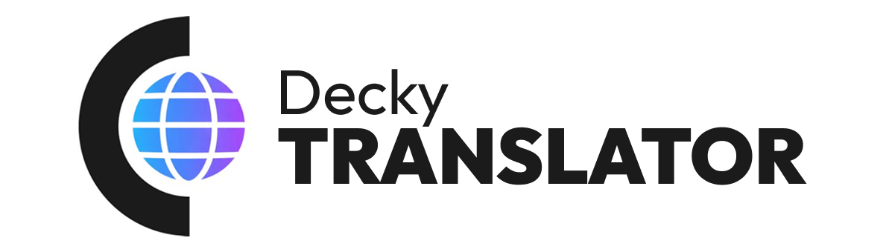
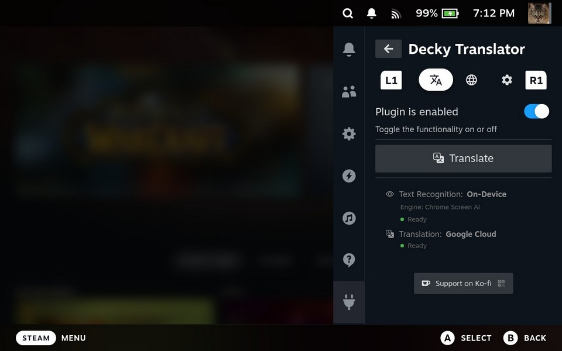

  

A [Decky Loader](https://github.com/SteamDeckHomebrew/decky-loader) plugin that lets you translate any text on your Steam Deck screen.

It captures your screen, recognizes text using OCR, translates it and then shows the result with screen overlay.

Might be helpful for learning a new language by playing games or some other purposes (you tell me!).

## Requirements

- Steam Deck (LCD or OLED)
- Experimental support for non-steamOS handhelds and distros
- [Decky Loader](https://github.com/SteamDeckHomebrew/decky-loader) installed
- Internet connection required for web-based providers and for initial download of offline models

## Installation

### From Decky Plugin Store
1. Install [Decky Loader](https://github.com/SteamDeckHomebrew/decky-loader/tree/main?tab=readme-ov-file#-installation) on your Steam Deck
2. Press <picture><source media="(prefers-color-scheme: dark)" srcset="assets/icons/light/qam.svg"></picture> to open the side bar and go to the Decky tab <picture><source media="(prefers-color-scheme: dark)" srcset="assets/icons/light/plug.svg"></picture>
3. In the upper right corner press <picture><source media="(prefers-color-scheme: dark)" srcset="assets/icons/light/store.svg"></picture> to view all the available plugins
4. Search for "Decky Translator" and install it

### Manual Installation
1. Install [Decky Loader](https://github.com/SteamDeckHomebrew/decky-loader/tree/main?tab=readme-ov-file#-installation) on your Steam Deck
2. [Download](https://github.com/cat-in-a-box/Decky-Translator/releases/latest/download/Decky.Translator.zip) the latest release from the [Releases](https://github.com/cat-in-a-box/decky-translator/releases) page
3. Upload *Decky.Translator.zip* archive to any directory on your Steam Deck
4. Press <picture><source media="(prefers-color-scheme: dark)" srcset="assets/icons/light/qam.svg"></picture>, go to the Decky tab <picture><source media="(prefers-color-scheme: dark)" srcset="assets/icons/light/plug.svg"></picture>, click <picture><source media="(prefers-color-scheme: dark)" srcset="assets/icons/light/gear.svg"></picture> and open the Developer section
5. Install Plugin from ZIP file -> "Browse" and then select *Decky.Translator.zip*

## How to use it?

1. Press "Translate" button in the main tab of the plugin
2. Press <picture><source media="(prefers-color-scheme: dark)" srcset="assets/icons/light/qam.svg"></picture> to open the menu again and press "Close Overlay"

## How to quickly use it?

1. Hold L4 button for a Quick Translation
2. Hold L4 button again to disable the translation overlay

Button or Combinations can be configured in the Controls tab

## How does it do that? 

Decky Translator allows you to choose different Text Recognition and Translation methods - feel free to experiment.

### Text Recognition (OCR)

| Provider                                                                                               | Type      | Description                                                                                            | Requirements              |
|--------------------------------------------------------------------------------------------------------|-----------|--------------------------------------------------------------------------------------------------------|---------------------------|
| [**Chrome Screen AI**](https://source.chromium.org/chromium/chromium/src/+/main:services/screen_ai/)   | On-device | OCR using Chromium's screen-ai library. The best recognition quality available                         | One-time 120 MB download  |
| [**RapidOCR**](https://github.com/RapidAI/RapidOCR)                                                    | On-device | OCR using PP-OCRv5 ONNX models. Alternative solution for on-device recognition                         | One-time 75 MB download   |
| [**Gemini Vision**](https://ai.google.dev/gemini-api)                                                  | Web       | Recognition and translation in a single API call. Best for stylized/in-game text, but is not very fast | Internet + API key        |
| [**OCR.space**](https://ocr.space/)                                                                    | Web       | Free EU-based Cloud OCR API with some usage limitations. Good choice if you don't translate very often | Internet                  |
| [**Google Cloud Vision**](https://cloud.google.com/vision)                                             | Web       | High accuracy and speed. Great for complex text. Has a great free tier, but requires some setup        | Internet + API key        |

### Translation

| Provider                                                                                     | Type      | Description                                                                                                                          | Requirements                |
|----------------------------------------------------------------------------------------------|-----------|--------------------------------------------------------------------------------------------------------------------------------------|-----------------------------|
| [**NLLB-200**](https://huggingface.co/facebook/nllb-200-distilled-1.3B)                      | On-device | Meta's NLLB-200 1.3B distilled model running locally via CTranslate2. Fully offline after download                                   | One-time 1.4 GB download    |
| [**Gemini Vision**](https://ai.google.dev/gemini-api)                                        | Web       | When Gemini is selected as the OCR provider, it returns the translation in the same call — no separate translation provider needed   | Internet + API key          |
| [**Google Translate**](https://translate.google.com/)                                        | Web       | It's Google. And it translates                                                                                                       | Internet                    |
| [**Google Cloud Translation**](https://cloud.google.com/translate)                           | Web       | High quality translations                                                                                                            | Internet + API key          |

**Note:** Google Cloud and Gemini require an API key but offer a generous free tier for personal use.

<h2>How to get Google Cloud API key?</h2>

### Step 1: Create a Google Cloud Project
1. Go to [Google Cloud Console](https://console.cloud.google.com/)
2. Click "Select a project" at the top, then "New Project"
3. Give your project a name (any name would work) and click "Create"

### Step 2: Enable Required APIs
1. Go to [APIs & Services > Library](https://console.cloud.google.com/apis/library)
2. Search for and enable:
   - **Cloud Vision API**
   - **Cloud Translation API**

### Step 3: Create an API Key
1. Go to [APIs & Services > Credentials](https://console.cloud.google.com/apis/credentials)
2. Click "Create Credentials" > "API Key"
   - *Authenticate API calls through a service account*: keep unchecked
   - Application Restrictions: None
3. Copy your new API key
4. If you need to find this API key later - press "Show key" button

### Step 4: (Optional) Restrict Your API Key
For security, you can restrict the API key to only the Vision and Translation APIs:
1. Click on your API key in the Credentials page
2. Under "API restrictions", select "Restrict key"
3. Select "Cloud Vision API" and "Cloud Translation API"
4. Click "Save"

### Step 5: Add API Key to Plugin
1. Open the Decky Translator plugin on your Steam Deck
2. Go to the Translation tab
3. Select Google Cloud Vision and/or Google Cloud Translation as your providers
4. Click "Set Key"
5. Enter your Google Cloud API key
6. Click "Save"

### API Key usually looks like this (but you should have your own):

### IMPORTANT: NEVER SHARE THIS API KEY WITH ANYONE!

### Pricing Note
Google Cloud offers a free tier that should be sufficient for personal use:
- **Vision API**: First 1,000 units/month free
- **Translation API**: First 500,000 characters/month free

**From my own experience**, even everyday usage of Decky Translator with Google Cloud for both recognition and translation rarely goes beyond their free tier. 
Only once I had to pay around 1€/month - and that was during VERY active development and testing phase. 

**But if you want to stay on the safe side anyway** - you could set up a budget limit and notification in [Billing > Budgets & Alerts](https://console.cloud.google.com/billing/budgets)

<h2>How to get Gemini API key?</h2>

Gemini Vision uses a separate key from Google Cloud — it comes from Google AI Studio, not the Cloud Console.

1. Go to [Google AI Studio](https://aistudio.google.com/app/apikey)
2. Sign in with your Google account
3. Click "Create API key" and pick a project (or let it create one for you)
4. Copy the key
5. In the plugin, open the Translation tab, select **Gemini Vision** as the OCR provider, click "Set Key", paste it, and Save

## Troubleshooting

### Black screen on capture
Try triggering translation again. If persistent, reboot your Steam Deck

### Translated text is too small
Try increasing the "Font Scaling" option in plugin settings

### Plugin says I'm using a wrong API key
Double-check that you entered it correctly. If the issue persists, please raise an issue - let's investigate it together

### I see nothing / Recognition is bad / It does not translate anything
Try other combination of text recognition and translation methods. If it doesnt solve the problem - please report it here [New Issue](https://github.com/cat-in-a-box/Decky-Translator/issues/new). It will also help if you attach your .log file there

## To-Do
### Functional
- [x] Add offline OCR functionality
- [x] Fix interface scaling issues on non-default SteamOS values (experimental)
- [x] Rework temporary files solution
- [x] Gamepad support
- [x] Overlay font scaling for large monitors
- [x] Fully offline Translation functionality
- [x] Support for non-SteamOS distros
- [ ] Disable in-game buttons while overlay is active
- [ ] Desktop mode support
- [ ] Nicer look for translation overlay
- [ ] TTS for translated text (press the translated label to listen)

## Third-Party Dependencies

This plugin uses the following third-party components. None of the heavy models are bundled in the plugin zip — they're downloaded on demand by a user.

### Chrome Screen AI library

The default on-device OCR engine that provides very impressive results. 
The shared library libchromescreenai.so and its TFLite models are pulled from Google's CIPD server on demand.

| Component | Source | License |
|-----------|--------|---------|
| libchromescreenai.so + TFLite models | [chromium/third_party/screen-ai](https://source.chromium.org/chromium/chromium/src/+/main:services/screen_ai/) via CIPD | BSD-3-Clause (Chromium) |

### RapidOCR Models (PP-OCRv5)

On-device OCR alternative. Based on [PaddleOCR](https://github.com/PaddlePaddle/PaddleOCR) models (Apache 2.0), exported to ONNX format.

- Text Detection + Chinese Recognition: [MeKo-Christian/paddleocr-onnx](https://github.com/MeKo-Christian/paddleocr-onnx)
- Chinese Dictionary + per-language Recognition models: [monkt/paddleocr-onnx](https://huggingface.co/monkt/paddleocr-onnx) (Apache 2.0)
- Text Classifier: [SWHL/RapidOCR](https://huggingface.co/SWHL/RapidOCR) (Apache 2.0)

| File | Purpose |
|------|---------|
| ch_PP-OCRv5_mobile_det.onnx | Text detection model (shared across all languages) |
| ch_rec.onnx + ch_dict.txt | Chinese/Japanese/English recognition |
| english_rec.onnx + english_dict.txt | English recognition |
| latin_rec.onnx + latin_dict.txt | Latin script (French, German, Spanish, etc.) |
| eslav_rec.onnx + eslav_dict.txt | East Slavic (Russian, Ukrainian) |
| korean_rec.onnx + korean_dict.txt | Korean recognition |
| greek_rec.onnx + greek_dict.txt | Greek recognition |
| thai_rec.onnx + thai_dict.txt | Thai recognition |
| ch_ppocr_mobile_v2.0_cls_infer.onnx | Text direction classifier |

### NLLB-200 Translation Model

Used for offline translation. Downloaded on demand from Hugging Face.

| Component | Source | License |
|-----------|--------|---------|
| NLLB-200 1.3B distilled (CT2 int8 conversion) | [JustFrederik/nllb-200-distilled-1.3B-ct2-int8](https://huggingface.co/JustFrederik/nllb-200-distilled-1.3B-ct2-int8) | CC-BY-NC 4.0 (Meta NLLB-200, **non-commercial use only**) |

The NLLB-200 weights are licensed by Meta for non-commercial use. The plugin does not redistribute them — the user downloads them directly from Hugging Face on demand.

### Python Packages (from PyPI)

| Package | License | Purpose |
|---------|---------|---------|
| Pillow==11.2.1 | MIT-CMU | Image processing for screenshot handling |
| requests==2.32.3 | Apache 2.0 | HTTP library for API calls |
| urllib3==2.4.0 | MIT | HTTP client (dependency of requests) |
| rapidocr>=3.6.0 | Apache 2.0 | OCR engine that runs the PP-OCRv5 ONNX models |
| onnxruntime>=1.7.0 | MIT | ONNX model inference runtime |
| ctranslate2>=4.5.0 | MIT | Inference engine for the NLLB-200 model |
| sentencepiece>=0.2.0 | Apache 2.0 | Tokenizer used by NLLB-200 |
| protobuf>=6.33.1 | BSD-3-Clause | Used by Chrome Screen AI for the inference protocol |

### Bundled Python Runtime

A portable Python 3.13 interpreter is bundled so the plugin works on distros where the system Python doesn't match (Bazzite, etc.). 
Pulled from [astral-sh/python-build-standalone](https://github.com/astral-sh/python-build-standalone), SHA256-verified in CI.

| Component                              | License                                                                     |
|----------------------------------------|-----------------------------------------------------------------------------|
| CPython 3.13 (python-build-standalone) | PSF-2.0, plus various component licenses (see python-build-standalone repo) |

### Web Fonts

Loaded from CDN on demand for the translated text overlay. Not bundled in the plugin.

| Source                                                                                                                                         | License                     |
|------------------------------------------------------------------------------------------------------------------------------------------------|-----------------------------|
| [Google Fonts](https://fonts.google.com/) (Open Sans, Montserrat, Noto Sans, Lexend, Atkinson Hyperlegible Next, Andika, etc.)                 | SIL Open Font License (OFL) |
| [OpenDyslexic](https://opendyslexic.org/) (via [@fontsource/opendyslexic](https://www.npmjs.com/package/@fontsource/opendyslexic) on jsDelivr) | SIL Open Font License (OFL) |

## Support

If you find this plugin useful - feel free to buy me a cup of coffee ❤️

## Thanks to

- [Valve](https://www.valvesoftware.com/) for creating the Steam Deck - a beautiful device that makes projects like this possible
- [UGT (Universal Game Translator)](https://github.com/SethRobinson/UGT) by Seth Robinson for inspiration and the idea of using game translation as a language learning tool
- [Decky Loader](https://github.com/SteamDeckHomebrew/decky-loader) team for the plugin framework
- [Steam Deck Homebrew](https://github.com/SteamDeckHomebrew) community for their amazing plugins, which served as a great reference while building this one
- [PaddleOCR](https://github.com/PaddlePaddle/PaddleOCR), [RapidOCR](https://github.com/RapidAI/RapidOCR) and [MeKo-Christian](https://github.com/MeKo-Christian/paddleocr-onnx) for OCR engine, OCR models and ONNX model exports that make offline text recognition possible
- [Chromium project](https://www.chromium.org/) for the screen-ai library
- [Meta AI](https://ai.meta.com/) for the NLLB-200 translation model
- [OpenNMT/CTranslate2](https://github.com/OpenNMT/CTranslate2) for the inference engine and [JustFrederik](https://huggingface.co/JustFrederik) for int8 conversion
- [OCR.space](https://ocr.space/) for the free OCR API
- [Google](https://google.com/) for Vision, Translation and Gemini API
- [astral-sh/python-build-standalone](https://github.com/astral-sh/python-build-standalone) for the portable Python runtime
- [steam3d](https://github.com/steam3d) for the SteamOS UI icons
- And You. Yes, You